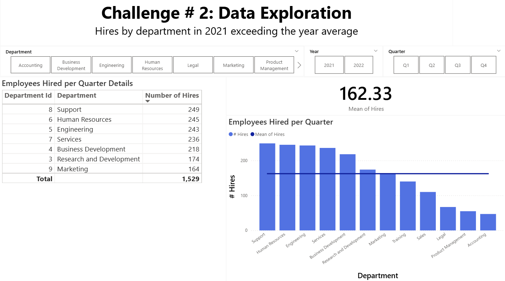

# PROJECT API Architecture


## Overview

This document describes the architecture of a solution which allows data loading from CSV files to a SQL database, backing up data on SQL database on avro files, and restoring data from avro files to SQL database. In general terms, the solution is composed by a REST API built with FastAPI (written un python), a SQL database in Azure SQL, and an Azure Storage Account

<!-- , which interacts with Azure SQL Database and Azure Storage Account. The REST API exposes three methods: `loadfiles`, `backupdata`, and `restore`. -->

## Components

As introduced above, this solution is composed mainly by three components: REST API, SQL Database and an Storage Account. More on them below:

### REST API

REST API is coded with python, using FastAPI. For SQL database connection it was used pyodbc library and for AVRO files data manipulation it was used fastavro. For azure identity operations and azure storage blob storage operations, it was used azure libraries

#### REST API Methods:

The API has the following methods:

##### GET `/loadfiles`
- **Description** loads the information of CSV files to target tables. There are 3 CSV files located on the Azure Storage Account
    - **jobs.csv** contains the information to load to table STAGE.Jobs
    - **departments.csv** contains the information to load to table STAGE.Departments
    - **hiredemployees.csv** contains the information to load to table STAGE.HiredEmployees

##### GET `/backupdata`
- **Description** backs the information up of tables dbo.Jobs, dbo.Departments and dbo.HiredEmployees onto AVRO files (one file per table). Destination files are saved on Azure Storage account

##### POST `/restore`
- **Description** restores the information of a target table (received via parameters) from corresponding backup AVRO file (from method `/backupdata`) to target table (it can be dbo.Jobs, dbo.Departments or dbo.HiredEmployees)
- **Parameters**
    - **target_table (string)** target table to be restored from backup

#### Relevant Aspects
- **Data Loading to Database** on methods `/loadfiles` and `/restore`, data loading to SQL database is done via bulk insert from CSV files, mainly due to faster performance. In case of restore from AVRO files, data is first converted to CSV before and then loaded from CSV to target table using bulk insert
- **STAGE DB Schema** there are two database schemas on database: dbo and STAGE. Tables Jobs, Departments and HiredEmployees exist on both schemas. The purpose of schema STAGE is to load the data from CSV files raw, not taking into consideration data integrity. After data load to STAGE schema tables is completed, data is then copied to tables on dbo schema, which contains the data in a clean format
- **Configuration** file config.env contains environment variables for Azure SQL database connection string and Azure Storege connection string

### Azure SQL Database

Image below displays an over-simplified database architecture, which shows the presence of tables Jobs, Departments and HiredEmployees on schemas dbo and STAGE:


#### Database Objects
```
Company Database/
├── dbo/
│   ├── Tables/
│   │   ├── Departments
│   │   ├── DimDate: date dimension
│   │   ├── HiredEmployees
│   │   └── Jobs
│   └── Views/
│       ├── VW_EMPLOYEES_HIRED_PER_DEPARTMENT_JOB_YEAR_QUARTER: returns the employees hired by Department, Job, Year and Quarter
│       └── VW_HIRES_PER_DEPARTMENT_EXCEEDING_YEAR_MEAN: returns the number of hires for each department, which exceed the mean of hires
├── STAGE/
│   ├── Tables/
│   │   ├── Departments
│   │   ├── LoadErrors: contains the load errors (offending records) while loading data for tables Jobs, Departments and HiredEmployees from STAGE schema to dbo
│   │   ├── HiredEmployees
│   │   └── Jobs
│   └── StoredProcedures/
│       └── USP_LOAD_DATA_TO_FINAL_TABLES: loads data for tables Jobs, Departments and HiredEmployees from STAGE schema to dbo, taking into consideration data integrity rules. In case of errors,they are logged on table STAGE.LoadErrors
```

### Azure Storage Account
It is a regular Azure Storage Account with a single container, containing source CSV files, AVRO backup files and data loading errors. It has the following folder structure

```
sources (continer)/
├── backup (folder): location where AVRO backup files are kept
├── sorucefiles (folder): location where source CSV files are kept
└── loaderrors (folder): location where data load error logs are kept
```

## Dockerfile

A Dockerfile was created to facilitate creating image of the solution and deploy to a container-based environment. 

Relevant aspects:
- **Base Image** it was used python:3.11-slim as the base image
- **System Dependencies and Other Packages** besides installing system dependecy packages it also installs Microsoft SQL Server package for Debian 11
- **REST API Requirements Installation** on repo it is present file requirements.txt, which contains the list of all libraries used on the API, which are to be installed as part of image creation
- **Run API** to run the API it is used uvicorn

## Reporting (Insights)

A Power BI file was created (ProjectInsights.pbix) to allow doing analytics with the data

The data model created is shown below:


Two pages were created on report:

### HiresPerDepartment


Allows analyzing the data of hired employees for each combination of department and job in every quarter of the year. By default year 2021 is selected. It also contains an stacked bar chart of the hires per department for each quarter

### HiresPerDepartment_MeanAverage



Allows reviewing the number of hires per department which exceed the departments average for the period selected. Mean hires is visible on the dashboards. It is also available a bar chart per department, displaying the total of hires of every department, compared against the mean of sales